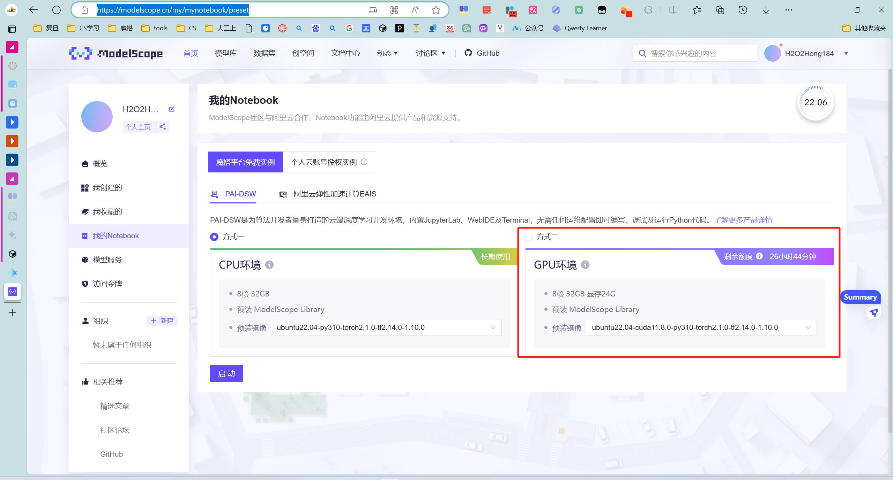
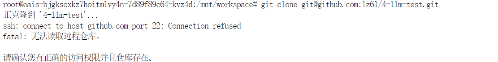
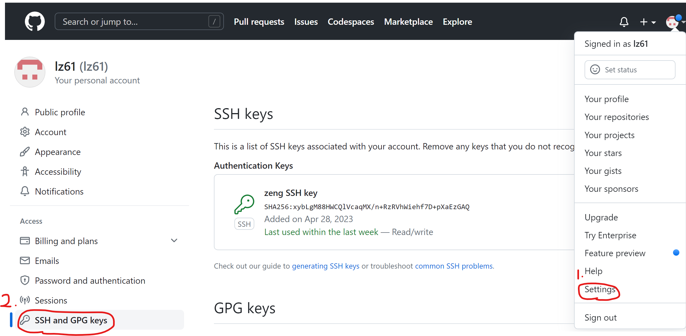

仓库代码：https://gitee.com/hong-chunyu/modelscope2023/tree/master
能跑的代码: 在gradio-front目录下

介绍：一款基于LLM的智能阅读器，主要是帮助用户集成订阅不同平台上的文章来源，实现文本摘要/关键词高亮等阅读增强功能；还有实现文章的智能QA（用户对订阅的文章提问），和智能筛选文章（分析用户阅读兴趣，帮助筛选）的功能

如何部署:

需要一个显存>22G的服务器,并把文件送到服务器上.(文件送到服务器上的过程请见文末.)

可以用阿里的modelscope平台上面的算力https://modelscope.cn/my/mynotebook/preset	



本地模型下载: 下载时最好开VPN?不开好像很难下载.

# 1. 如何将文件送到服务器上?

方式:

```
git clone git@github.com:lz61/4-llm-test.git
```

问题:



本地部署文件太大,不太好.

# 2. 直接使用hcy老师给出的gitee地址部署代码即可

问一下hcy:当你在Jupyter Notebook中使用git连接gitee仓库时,怎么把gitee仓库中的代码直接Git clone下来的?我是真的不懂.

因为gitee仓库的所有者没有把你加入到仓库中,自然是无法git clone的!


# 3. 总结: 如何将GitHub上的代码部署到ModelScope服务器平台上?

## 3.1 将对应服务器密钥添加到GitHub密钥管理器中

命令:

```
ssh-keygen -t rsa -b 4096 -C "2486851360@qq.com"
Enter file in which to save the key (/root/.ssh/id_rsa): Enter 即可.
Enter passphrase: no passphrase.
cat ~/.ssh/id_rsa.pub,复制粘贴本地密钥
```

添加到github密钥管理器中:



```
git clone git@github.com:lz61/4-llm-test.git
```


## 4.2 git clone成功后,运行如下命令安装并启动依赖：

```
(cd进入源代码文件夹)
pip install -r requirements.txt
python app.py
```

# 5. 使用chatRoom APP来检验服务器是否允许外部访问

查看本机ip地址: 

# 6. 暂时不用管公共访问

直接访问:

```
Running on local URL:  http://127.0.0.1:7860
```

点击对应的

```
http://127.0.0.1:7860即可
```

或者访问

```
https://dsw-gateway-cn-hangzhou.data.aliyun.com/dsw-232449/proxy/7860/
```

注意最后的/一定要加上 

# 7. 下一步: ModelScope公网访问

思考:如何在运行了app.py后,让阿里云提供公网地址,并提供服务?

公网很麻烦.

[参考教程: ModelScope公网访问](https://developer.aliyun.com/ask/534353#:~:text=%E8%AE%BE%E7%BD%AE%E5%85%AC%E5%85%B1%20IP%20%E6%88%96%E5%9F%9F%E5%90%8D%EF%BC%9A%E4%B8%BA%20ModelScope%20Notebook%20%E6%9C%8D%E5%8A%A1%E8%AE%BE%E7%BD%AE%E4%B8%80%E4%B8%AA%E5%85%AC%E5%85%B1%20IP%20%E5%9C%B0%E5%9D%80%E6%88%96%E5%9F%9F%E5%90%8D%E3%80%82,Notebook%20%E6%9C%8D%E5%8A%A1%EF%BC%9A%E7%A1%AE%E4%BF%9D%20ModelScope%20Notebook%20%E6%9C%8D%E5%8A%A1%E5%B7%B2%E7%BB%8F%E5%90%AF%E5%8A%A8%E5%B9%B6%E6%AD%A3%E5%9C%A8%E7%9B%91%E5%90%AC%E6%8C%87%E5%AE%9A%E7%9A%84%E7%AB%AF%E5%8F%A3%E3%80%82%20%E6%82%A8%E5%8F%AF%E4%BB%A5%E4%BD%BF%E7%94%A8%E9%80%82%E5%BD%93%E7%9A%84%E5%91%BD%E4%BB%A4%E6%88%96%E8%84%9A%E6%9C%AC%E6%9D%A5%E5%90%AF%E5%8A%A8%20Notebook%20%E6%9C%8D%E5%8A%A1%EF%BC%8C%E5%B9%B6%E7%A1%AE%E4%BF%9D%E5%AE%83%E4%B8%80%E7%9B%B4%E5%9C%A8%E8%BF%90%E8%A1%8C%E3%80%82)
