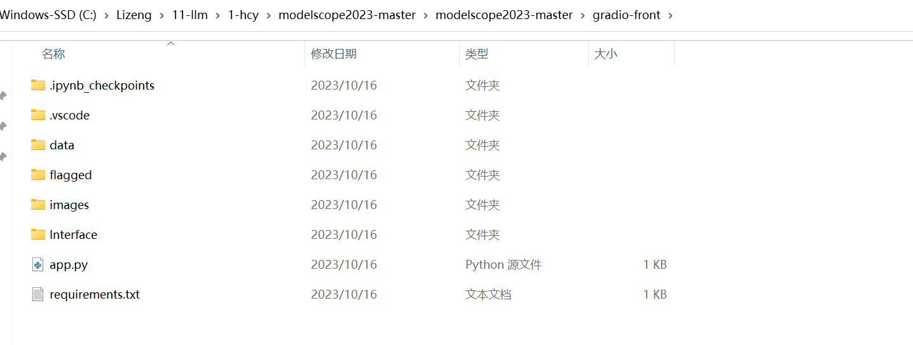
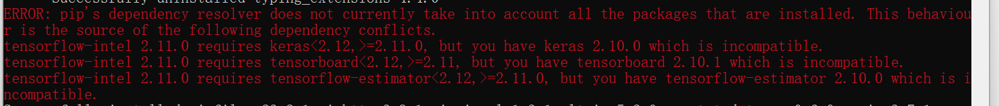

# 1. 进入gradio-front文件夹

观察文件目录:

```
-.ipynb_checkpoints
-.vscode
-data
-flagged
-images
-Interface
app.py
requirements.txt
```




丢入文件结构目录,问问chatGPT怎么set up:

It seems like you have a project structure with a Python file (`app.py`), a `requirements.txt` file, and some directories. Assuming this is a web application using Python, here are general steps to deploy and run the code:

## 1.1 Set Up a Virtual Environment:

It's a good practice to use virtual environments to isolate your project dependencies. Open a terminal in the root directory of your project and run:

```
python -m venv venv
```

Activate the virtual environment:

- On Windows:

```
venv\Scripts\activate
```

- On Unix or MacOS:

```
source venv/bin/activate
```

## 1.2 Install Dependencies:

With the virtual environment activated, install the required packages using `pip`:

```
pip install -r requirements.txt
```

## 1.3 Run the Application Locally:

Assuming your `app.py` is the main entry point for your application, you can run it locally:

```
python app.py
```

This should start your application locally. Visit `http://localhost:5000` in your web browser (assuming your application runs on port 5000 by default).

# 由于显存需要>22G，且模型下载速度太慢,因此不推荐本地部署,还得是用阿里大模型平台modelscope.

# switch: 阿里大模型平台modelscope:

## 1.问题1: 如何将本地gradio-front文件夹中所有内容上传到modelscope平台?

## 1.1 方法1

手动一个一个上传

拒绝,原因: 太慢

## 1.2 方法2

启动机器后使用git拉取自己远程的github仓库镜像

显示:

```
fatal: 无法读取远程仓库。

请确认您有正确的访问权限并且仓库存在。
```

原因:

老原因了,从github远程仓库中pull代码需要添加本机SSH key.

详情请见git与github文件夹(在Share-Common文件夹下).

拒绝,原因: 阿里云似乎不支持如此做(可以考虑再尝试一下,不行问洪老师)

## 1.3 方法3

上传zip文件包,再用ubuntu(不尝试)


# End. 不应当采用的方法(传统Setup):

# 先安装requirements.txt

```
pip install -r requirements.txt
```

遇到的麻烦:



说不定后面需要返工.


