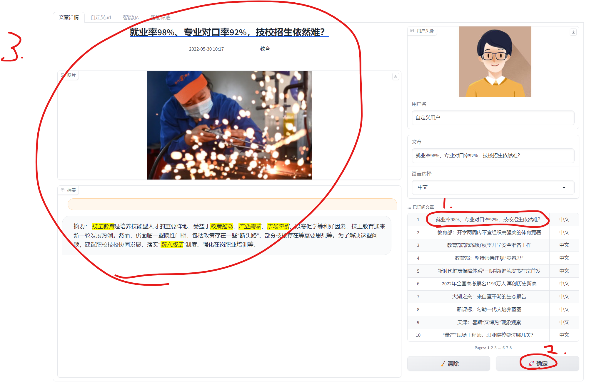

访问页面: https://dsw-gateway-cn-hangzhou.data.aliyun.com/dsw-232449/proxy/7860/

注意最后的/

# 1. 四大页面

## 1.1 页面1:文章详情

## 1.2 自定义url: 

同理,选择右下角内容并生成文章摘要

可选择url: https://zhuanlan.zhihu.com/p/53571812

## 1.3 智能QA: 对文章内容进行智能问答

### 1.3.1 操作流程

1.选择右侧的"已订阅文章"

2.输入你的问题,请大模型回答对应问题

## 1.4 用户文章筛选

为用户筛选对应的文章,并推荐给用户

已阅读->已筛选

